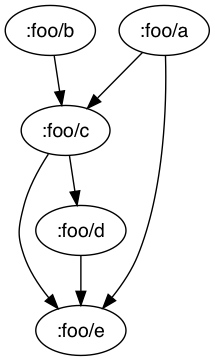
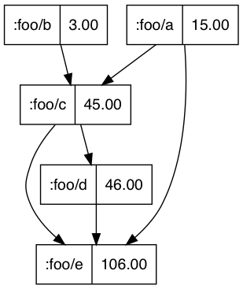
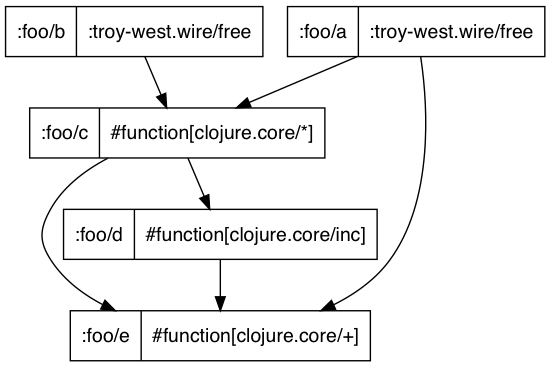

# Wire

  [](https://clojars.org/com.troy-west/wire)
  
  ## Description

  A small Clojure library for explicitly wiring together functions into
  declarative computation graphs.

  This approach has some similarities to [Dataflow Programming](https://en.wikipedia.org/wiki/Dataflow_programming).
  Unlike Dataflow Programming this library simply provides an approach to
  composing pure functions, it does not provide Dataflow variable or try to
  solve any concurrency related problem. By default it does not provide any
  memoization, caching, parrallel computation, partial evaluation or reactive
  programming.

  This library was inspired from working with formula, either given in hand
  written form or via a spreadsheet. These can be tricky to work with for a
  number of reasons:

  * All variables/cells have global scope
  * Understanding dependents/dependencies can be difficult
  * Reporting/debugging intermediate values in a computation can force
    awkward restructuring of code
  * It is difficult to know how to best structure your code
    * Calling dependent functions leads to repeated computation
    * Large let blocks don't compose

  By making the workflow of the computations explicit with a declarative
  graph it helps handle many of these issues:

  * Within the scope of a graph values can be accessed by any other part of
    the graph
  * The flow of dependencies is made very clear and can be easily visualised
  * The result of executing a graph is simply a map of all the values, this
    assists with reporting and debugging intermediate values
  * Graphs written as maps can compose with `merge` and other simple
    utility functions
  * Functions are written in a dependency injection style leading to
    good decoupling
  * As requirements change restructuring of code mainly consists of composing
    in new graphs into the flow or rewiring functions at the graph declaration
    level
  * Namespaced keywords enable composing and reusing subgraphs in larger flows

  ## Usage

  Functions can be declaratively wired together into a dependency map like such:

  ```clojure
  => (def dep-map {:foo/c [[:foo/a :foo/b]
                           *]
                   :foo/d [[:foo/c]
                           inc]
                   :foo/e [[:foo/a :foo/c :foo/d]
                           +]})
  ```

  The dependency map can be compiled to a graph as follows:

  ```clojure
  => (require '[troy-west.wire :as wire])
  => (wire/compile-graph dep-map)
  {:wire/dep-graph #clojure.tools.namespace.dependency.MapDependencyGraph
   {:dependencies {:foo/c #{:foo/a :foo/b},
                   :foo/d #{:foo/c},
                   :foo/e #{:foo/a :foo/c :foo/d}},
    :dependents {:foo/a #{:foo/c :foo/e},
                 :foo/b #{:foo/c},
                 :foo/c #{:foo/d :foo/e},
                 :foo/d #{:foo/e}}},
   :wire/dep-map {:foo/c [[:foo/a :foo/b] #<Fn@33ac9a84 clojure.core/_STAR_>],
                  :foo/d [[:foo/c] #<Fn@5103b66c clojure.core/inc>],
                  :foo/e [[:foo/a :foo/c :foo/d]
                          #<Fn@72cd95df clojure.core/_PLUS_>]}}
  ```

  You can find out if there are any unbound variables within the graph using
  `free-variables`:

  ```clojure
  => (def graph (wire/compile-graph dep-map))
  => (wire/free-variables (:wire/dep-graph graph))
  #{:foo/b :foo/a}
  ```

  To execute a computation using the graph you will need to provide values for
  the free variables:

  ```clojure
  => (wire/execute-graph graph {:foo/a 15 :foo/b 3})
  #:foo{:a 15, :b 3, :c 45, :d 46, :e 106}
  ```

  You can also compile and execute in one step:

  ```clojure
  => (wire/compile-and-execute dep-map {:foo/a 15 :foo/b 3})
  #:foo{:a 15, :b 3, :c 45, :d 46, :e 106}
  ```

  Bound values can be overwritten with values in the `args` map,
  useful for testing:

  ```clojure
  => (wire/compile-and-execute dep-map {:foo/a 15 :foo/b 3 :foo/c 20})
  #:foo{:a 15, :b 3, :c 20, :d 21, :e 56}
  ```

  ### Composition

  Dependency maps can be composed with `merge`:

  ```clojure
  => (wire/compile-and-execute (merge dep-map {:foo/b [[:foo/a] dec]})
                               {:foo/a 15})
  #:foo{:a 15, :b 14, :c 210, :d 211, :e 436}
  ```

  There are also a number of helper functions to add in composition of
  dependency maps, see their doc strings for usage examples:
  `with-ns`, `replace-keys`, `replace-namespaces`, `append-ns`, `filter-ns`,
  `re-filter-ns`, `list-namespaces`

  ### Visualisation

  There are three built in functions for visualising graphs,
  `viz-graph-names`, `viz-graph-results` and `viz-graph-fns`.

  Each can be called like:

  ```clojure
  => (wire/viz-graph-names graph {:foo/a 15 :foo/b 3})
  ```
  
  ```clojure
  => (wire/viz-graph-results graph {:foo/a 15 :foo/b 3})
  ```
  
  ```clojure
  => (wire/viz-graph-fns graph {:foo/a 15 :foo/b 3})
  ```
  

## License

Copyright © 2018 [Troy-West, Pty Ltd.](http://www.troywest.com)

Distributed under the Eclipse Public License either version 2.0 or (at your option) any later version.
